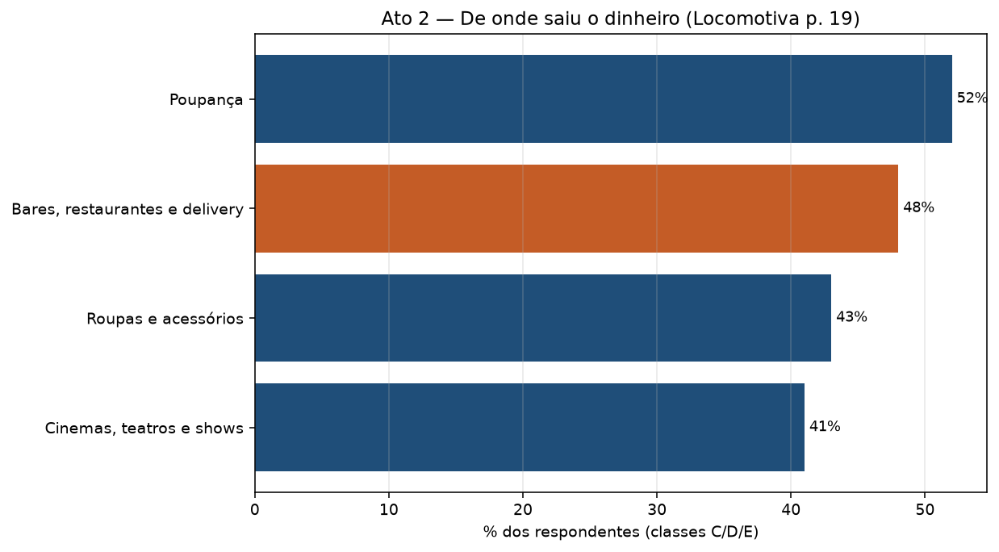
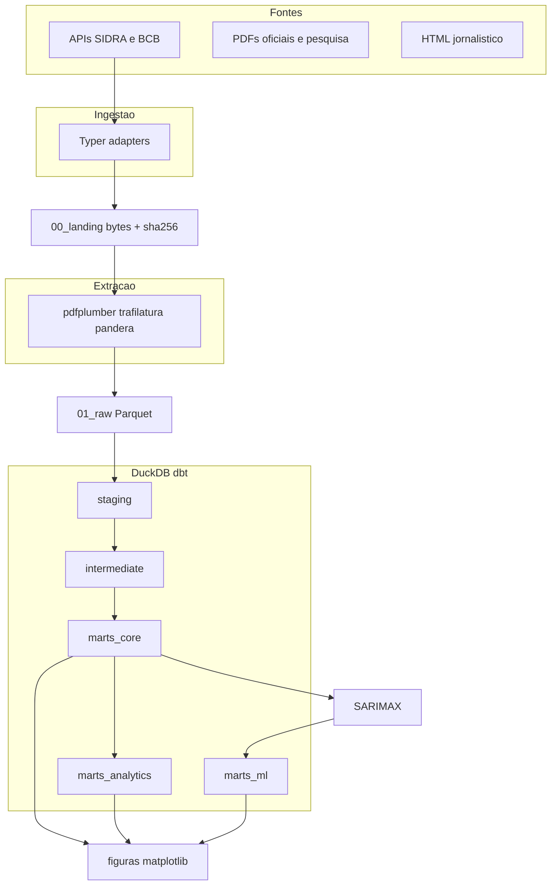
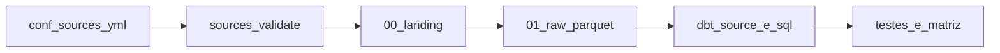

# bets-cerveja

[](https://github.com/Kaynan1101/bets-cerveja/actions/workflows/ci.yml)

Onde foi parar o fim de semana do brasileiro — de onde saiu o dinheiro das apostas (2023–2026).

Pipeline de dados e análise sobre a composição do gasto discricionário no Brasil depois da regulamentação das apostas. A pergunta não é se a produção de cerveja caiu no agregado (os Anuários do MAPA mostram estabilidade). A pergunta é de onde saiu o dinheiro que foi para as bets, e o que isso implica para o canal on-premise (bares, restaurantes e delivery).



## Limites causais (leia isto primeiro)

Nenhuma fonte do acervo liga, de forma quantificada, redução de consumo de cerveja a aumento de gasto com apostas. A ponte empírica é o canal **bares, restaurantes e delivery** no survey da Locomotiva (48% dos apostadores das classes C/D/E dizem ter tirado o dinheiro daí). O projeto trata isso como ponte, não como evidência de substituição litro a litro.

O contrafactual SARIMAX (etapa 8) deve confirmar **ausência de anomalia agregada**. Isso é resultado, não falha.

## O que este repositório faz

Camadas Medallion com fronteira rígida entre I/O (Python) e SQL de negócio (dbt). Janela analítica **2023–2026**. Clima, safra de insumos e GGR oficial da SPA estão fora de escopo ([ADR 0004](docs/adr/0004-sem-panorama-spa.md)). GLP-1 entra só como hipótese rival no artigo, não no modelo.

Três atos que o warehouse precisa sustentar:

1. **Ato 1.** A cerveja não caiu no agregado; a manchete de 2025 inverte conforme o vintage de 2024. Fecha com o contrafactual SARIMAX dentro do intervalo.
2. **Ato 2.** De onde saiu o dinheiro (Locomotiva / Fundaj / BCB EE119 / Klavi) e o que mudou por dentro do mix — sem tratar quebra metodológica como tendência.
3. **Ato 3.** Contraste estrutural (emprego, receita, custo social) com duas definições lado a lado, sem média.

A apresentação são figuras matplotlib em `exports/figures/`, não Power BI ([ADR 0005](docs/adr/0005-figuras-em-vez-de-power-bi.md)).

## Arquitetura



| Camada | Ferramenta | Motivo |
| --- | --- | --- |
| Fundação | `uv` + Python 3.12 | Lockfile. `requires-python = ">=3.12,<3.13"` — 3.14 não tem wheel estável para dbt. |
| Registro | Pydantic em [`src/betscerveja/registry.py`](src/betscerveja/registry.py) | [`conf/sources.yml`](conf/sources.yml) entra no lake só se o schema passar. |
| Ingestão | Typer, httpx, tenacity | I/O sujo. dbt não faz chamada de rede: se a SIDRA cair, `dbt build` ainda roda no raw. |
| Extração | pdfplumber, trafilatura, pandera | Parser em [`src/betscerveja/extract/runner.py`](src/betscerveja/extract/runner.py). Pandera testa forma (`RawApiSeries` / `RawExtract`); dbt testa semântica. |
| Lake | Parquet + DVC (Cloudflare R2) | Landing imutável. Bytes em `data/00_landing.dvc` e `data/01_raw.dvc`. |
| Warehouse | DuckDB | Um arquivo, zero servidor. `warehouse/betscerveja.duckdb` no `.gitignore`. |
| Transformação | dbt-duckdb | Todo SQL de negócio. Lineage e testes colados no model. |
| Orquestração | Dagster | [ADR 0001](docs/adr/0001-orquestracao-dagster-em-vez-de-airflow.md). A CI não dispara ingest. |
| ML | statsmodels SARIMAX | Coeficiente, IC e p-valor. Precisamos poder dizer "efeito indistinguível de zero". |
| Apresentação | matplotlib | Consome o DuckDB; grava `exports/figures/*.png` + HTML. |

Detalhe das camadas: [docs/architecture.md](docs/architecture.md).

## Layout

```
conf/                  sources.yml + metrics.yml (contrato declarativo)
src/betscerveja/       CLI, ingest, extract, SARIMAX, figuras, pacote Zenodo
transform/             dbt-duckdb (staging → intermediate → marts)
orchestration/         assets Dagster (ingest / extract / dbt / forecast)
data/00_landing/       bytes originais + _manifest.jsonl (DVC; não editar)
data/01_raw/           extract.parquet 1:1 com a extração (DVC)
data/sample/           sete Parquets commitados no Git, para make demo
warehouse/             betscerveja.duckdb (gitignored)
exports/figures/       PNG + index.html
exports/zenodo/        pacote derivado (make demo)
tests/                 pytest (CLI, extract, forecast, figuras, demo)
```

`data/00_landing/<source_id>/seed/` marca coleta anterior ao pipeline. A ingestão de rede grava `data/00_landing/<source_id>/<YYYY-MM-DD>/payload.*`. Regras do lake: [data/README.md](data/README.md).

## Modelo de dados

O profile dbt prefixa o schema com `main_`. Três schemas de marts, papéis distintos:

| Schema DuckDB | Pasta | Papel |
| --- | --- | --- |
| `main_marts_core` | `transform/models/marts/core/` | Star schema estável. Entra nas figuras (produção anual, série mensal). |
| `main_marts_analytics` | `transform/models/marts/analytics/` | Agregados por pergunta (`agg_*`, `qa_divergencias`). Folha do DAG, reescrevível. |
| `main_marts_ml` | `transform/models/marts/ml/` | `ml_dataset_cerveja_mensal` é dbt. `fct_cerveja_previsao`, `ml_metricas` e `ml_coeficientes` são Python. |

Grains que não podem ser improvisados (lista completa em [docs/grain.md](docs/grain.md)):

| Tabela | Grain |
| --- | --- |
| `dim_fonte` | `source_id` + `vintage_publicacao` |
| `fct_serie_mensal` | mês × métrica × geografia |
| `fct_indicador_declarado` | fonte × métrica × período × geografia × recorte (com `pagina` e `citacao_textual`) |
| `fct_mercado_cerveja_anual` | ano de referência × **vintage** × UF |
| `qa_divergencias` | métrica × período × par de fontes/vintages |

`ano_referencia` e `vintage_publicacao` são campos distintos. Sem os dois, a retificação de 2024 (15,344 bi L no Anuário pub 2025 vs 17,211 bi L no pub 2026) vira um único número errado.

Não misturar `fluxo_bruto_apostado` (Pix, EE119), `ggr` (reservado, ADR 0004) e `destinacoes_legais`. Catálogo: [conf/metrics.yml](conf/metrics.yml) e [docs/data_dictionary.md](docs/data_dictionary.md).

## Ambiente

- Python **3.12** (`uv`). Não use 3.13+.
- Make. No Windows o Makefile assume um `make` no PATH (Git Bash, chocolatey, ou equivalente).
- Lake completo: par de chaves R2 (`AWS_ACCESS_KEY_ID` / `AWS_SECRET_ACCESS_KEY`) no `.env` local e nos secrets do GitHub. Demo não precisa.

Override do warehouse: `BETSCERVEJA_DUCKDB_PATH` (default `warehouse/betscerveja.duckdb`, ver [`transform/profiles.yml`](transform/profiles.yml)).

### Demo sem R2

Usa os sete `extract.parquet` commitados em [`data/sample/`](data/sample/README.md). A CI **não** usa esta pasta.

```powershell
uv sync --extra dev
make sources
make test
make demo
```

`make demo` materializa warehouse + SARIMAX + figuras + `exports/zenodo/` a partir do sample.

### Lake completo (DVC)

```powershell
uv sync --extra dev
make dvc-pull
make extract
uv run betscerveja extract --source anuario_cerveja_ref2025_pub2026
make dbt-build
make sarimax
make figures
```

`make extract` cobre só as quatro APIs (SIDRA 8885/8888/7060 e BCB SGS 24364). PDF/HTML extraem-se fonte a fonte. Depois de clonar sem o lake: `make dvc-pull`. Checklist operacional: [docs/implementacao.md](docs/implementacao.md).

## CLI e Make

Entrypoint: `betscerveja` → [`src/betscerveja/cli.py`](src/betscerveja/cli.py).

| Alvo Make | Equivalente CLI | O que faz |
| --- | --- | --- |
| `make sources` | `betscerveja sources validate` + `list` | Valida o YAML e lista o registro |
| — | `betscerveja sources show <id>` | Dump JSON de uma fonte |
| `make ingest` | `betscerveja ingest --source …` | SIDRA 8885 + BCB rendimento (só essas duas no Make) |
| `make extract` | `betscerveja extract --source …` | Quatro APIs → `data/01_raw/.../extract.parquet` |
| `make dbt-build` | `scripts/export_dbt_seeds.py` + `dbt build` | Seeds a partir do YAML; staging → marts |
| `make sarimax` | `betscerveja forecast` | Escreve as três tabelas Python em `main_marts_ml` |
| `make figures` | `betscerveja figures` | Lê o DuckDB; **não** recomputa o SARIMAX |
| `make demo` | `betscerveja demo` | Sample → warehouse → figuras → Zenodo |
| `make dvc-pull` / `dvc-push` | `scripts/dvc_run.py` | Lake no R2 |
| `make lint` | `ruff check` + `ruff format --check` | `src`, `tests`, `orchestration` |
| `make test` | `pytest` | Contratos Python |
| `make ci` | lint + test + dvc-pull + dbt + sarimax | O que a GitHub Action roda |
| `make dagster-dev` | `dagster dev -m orchestration.definitions` | UI local. Job `build_warehouse` = `dbt build` |

CI: lint → test → `dvc pull` → `dbt build` → SARIMAX. Pages publica só o catálogo `dbt docs`, não as figuras.

## Ingestão de dados novos

Contrato: **fonte nova entra no YAML antes de entrar no lake.** O passo a passo curto está em [CONTRIBUTING.md](CONTRIBUTING.md); o que segue é o caminho até o warehouse.



### Regra 0

Adapters existentes em [`src/betscerveja/registry.py`](src/betscerveja/registry.py): `api_sidra`, `api_bcb`, `http_file`, `http_page`, `manual`. Não invente adapter paralelo. `manual` não baixa nada; `fora_de_escopo` recusa ingest.

Campos que o Pydantic exige (e por quê): [docs/sources.md](docs/sources.md). PDF no lake precisa de `vintage_publicacao` + `landing_filename`. `id` é slug ASCII.

Depois de editar o YAML:

```powershell
uv run betscerveja sources validate
```

Se o Pydantic recusar, o YAML está errado — não force o arquivo para o lake.

### Receita A — série SIDRA / BCB (rede)

1. Entrada em [`conf/sources.yml`](conf/sources.yml): `id` slug, `tipo: api`, `adapter` (`api_sidra` ou `api_bcb`), `api_path` começando com `/`, `dominio` (`cerveja` / `apostas` / `macro`), `tier_confiabilidade`, `e_oficial`, `status_acervo`.
2. `uv run betscerveja sources validate`.
3. `uv run betscerveja ingest --source <id>` → `data/00_landing/<id>/<YYYY-MM-DD>/payload.json` + `_manifest.jsonl` (sha256). Se o hash já existir, a ingestão é no-op (`skipped: true`).
4. `uv run betscerveja extract --source <id>` → `data/01_raw/<dominio>/<id>/extract.parquet`, validado por `RawApiSeries` ([`src/betscerveja/schemas/raw.py`](src/betscerveja/schemas/raw.py)).
5. Registrar a tabela em [`transform/models/staging/_sources.yml`](transform/models/staging/_sources.yml):

   ```yaml
   - name: <id>
     meta:
       external_location: "{{ var('raw_root') }}/<dominio>/<id>/extract.parquet"
   ```

6. Incluir o `union all` em [`transform/models/staging/stg_raw_api.sql`](transform/models/staging/stg_raw_api.sql). O filtro de negócio fica em [`transform/models/intermediate/int_serie_mensal.sql`](transform/models/intermediate/int_serie_mensal.sql) — exemplo já no código: SIDRA 8885 só categoria `129192` (CNAE 11.1); IPCA 7060 só item cerveja.
7. Métrica nova: entrada em [`conf/metrics.yml`](conf/metrics.yml). `make dbt-build` já roda [`scripts/export_dbt_seeds.py`](scripts/export_dbt_seeds.py) e regenera `seed_metricas` / `seed_fontes`.
8. Versionar o lake: `dvc add data/01_raw` (e `data/00_landing` se houver bytes novos) e `make dvc-push`. Se o demo precisar do Parquet: `uv run python scripts/sync_sample.py` — o script **para** se `data/01_raw` estiver vazio.

Afirmação que a série sustenta: uma linha em [docs/fontes_lacunas.md](docs/fontes_lacunas.md) (granularidade + o que continua faltando).

### Receita B — PDF / HTML

1. Mesmo YAML. PDF no lake exige `vintage_publicacao` e `landing_filename`. `tipo: pdf` + `adapter: http_file`, ou `tipo: html` + `adapter: http_page`.
2. Rede: `uv run betscerveja ingest --source <id>`. Já baixado: grave em `data/00_landing/<id>/seed/<landing_filename>`. Não grave pastas `*_files` de HTML salvo no Chrome.
3. Extract:

   ```powershell
   uv run betscerveja extract --source anuario_cerveja_ref2025_pub2026
   ```

   `make extract` **não** cobre Anuários. A saída é `RawExtract`: uma linha de texto por página (`pdfplumber_text`) e uma linha por tabela (`pdfplumber_table`, células em `celulas_json`). HTML vira um único trecho via trafilatura.
4. Número citado: linha em [`transform/seeds/seed_citacoes.csv`](transform/seeds/seed_citacoes.csv) com `pagina`, `citacao_textual` e `fato` (`indicador`, `substituicao` ou `mercado_anual`) **e** a matriz em [docs/fontes_lacunas.md](docs/fontes_lacunas.md). HTML jornalístico entra como evidência de que o número circulou; a métrica canônica aponta para quem mediu (Euromonitor, Nielsen, Klavi, Scanntech).
5. Parse específico (regex de página, como [`int_producao_anuario.sql`](transform/models/intermediate/int_producao_anuario.sql)) só depois do grain declarado em [docs/grain.md](docs/grain.md). O seed é fallback se o extract não achar o número; não é atalho para SIDRA/BCB.
6. Registrar o Parquet em `_sources.yml` e no `union all` de [`stg_raw_pdf.sql`](transform/models/staging/stg_raw_pdf.sql) se o dbt for ler o extract. Depois: `make dbt-build`, DVC, e `scripts/sync_sample.py` se o demo depender desse arquivo.

O nome do Anuário no lake é `anuario_cerveja_refAAAA_pubBBBB.pdf`. O ano no site do MAPA é o de referência, não o de publicação: `anuario-da-cerveja-2025.pdf` era o Anuário 2026 (dados de 2025).

### Receita C — indicador esparso já no acervo

Sem série mensal, não invente `fct_serie_mensal`. Números de um corte (EE119 de agosto/2024, emprego IEPS vs IBJR, Locomotiva p. 19) caem em `fct_indicador_declarado` ou `fct_substituicao_declarada` via `seed_citacoes` + [`int_citacoes.sql`](transform/models/intermediate/int_citacoes.sql).

Divergência de definição — dois vintages de 2024, IEPS 1.144 vs IBJR 15.500, kg vs litros — vai para `qa_divergencias` / `seed_qa_divergencias`. Duas linhas, sem média. Tipos aceitos no seed: `vintage`, `unidade`, `definicao`, `amostra_vs_universo`, `fluxo_vs_receita`.

## Melhorar o projeto

Cada caminho abaixo toca um contrato existente. Não pule o YAML nem o grain.

### Métrica canônica

1. Declare o `id` em [`conf/metrics.yml`](conf/metrics.yml) com `unidade`, `periodicidade` e `distingue_de` quando houver risco de colisão (Pix ≠ GGR).
2. `make dbt-build` exporta `seed_metricas` → `dim_metrica`.
3. Não reutilize `ggr` para fluxo Pix. Não some produção MAPA com consumo Euromonitor.

### Grain / fato novo

1. Escreva a chave em [docs/grain.md](docs/grain.md) **antes** do SQL. Sem ADR, não mude grain de tabela já listada.
2. Model em `transform/models/marts/…` + testes `unique` / `not_null` / `relationships` no YAML do model. FK composta `(source_id, vintage_publicacao)` → `dim_fonte`.
3. `make dbt-build` tem que ficar verde.

### Figura nova

1. Leia um mart existente — não o landing — em [`src/betscerveja/figures/render.py`](src/betscerveja/figures/render.py).
2. Inclua o PNG em `REQUIRED_ARTIFACTS` e em [`tests/test_figures.py`](tests/test_figures.py).
3. Não plote `agg_mix_produto`. A queda 4,9% → 1,27% do mix sem álcool é quebra metodológica; o V do puro malte são três medidas de vintage ([docs/fontes_lacunas.md](docs/fontes_lacunas.md)).
4. `make figures` não entra em `make ci`. Regenerar via `make demo` se o sample cobrir o mart.

### SARIMAX

- Dataset: model dbt `ml_dataset_cerveja_mensal`.
- Saídas: `betscerveja forecast` grava `fct_cerveja_previsao`, `ml_metricas`, `ml_coeficientes` no DuckDB. Não são models dbt — o forecast não cabe em SQL.
- Hipótese rival (GLP-1, clima, cerveja zero como série própria) fica fora do modelo ([docs/trabalho_futuro.md](docs/trabalho_futuro.md)).

### Decisão de arquitetura

ADR novo em [`docs/adr/`](docs/adr/README.md). ADR aceito é imutável; se a decisão mudar, o arquivo novo supersede o anterior. Não instalar Airflow “para o currículo” ([ADR 0001](docs/adr/0001-orquestracao-dagster-em-vez-de-airflow.md)).

### Qualidade

```powershell
make lint
make test
make dbt-build
```

pytest cobre CLI, extract, forecast, figuras e demo. dbt cobre contratos, `relationships` e `qa_divergencias`. A Action em [`.github/workflows/ci.yml`](.github/workflows/ci.yml) é `make ci` (precisa dos secrets R2); o job `pages` (só `main`) publica o catálogo dbt.

Dagster local: `make dagster-dev`. Jobs `ingest_sources` / `extract_sources` são rede; `build_warehouse` só corre `dbt build`; `build_forecast` assume `ml_dataset_cerveja_mensal` já materializado.

## Documentação

| Arquivo | Para quê |
| --- | --- |
| [docs/etapas.md](docs/etapas.md) | Ordem em que o pipeline foi construído |
| [docs/architecture.md](docs/architecture.md) | Camadas e por que cada ferramenta está onde está |
| [docs/adr/0005-figuras-em-vez-de-power-bi.md](docs/adr/0005-figuras-em-vez-de-power-bi.md) | Por que figuras, não Power BI |
| [docs/grain.md](docs/grain.md) | Chave de cada tabela final — escrever **antes** de modelar |
| [docs/fontes_lacunas.md](docs/fontes_lacunas.md) | Matriz afirmação → fonte. Afirmação sem fonte muda no papel |
| [docs/sources.md](docs/sources.md) | Como ler `conf/sources.yml` |
| [docs/data_dictionary.md](docs/data_dictionary.md) | Métricas canônicas (não misturar GGR com fluxo bruto) |
| [docs/trabalho_futuro.md](docs/trabalho_futuro.md) | O que ficou de fora de propósito |
| [docs/implementacao.md](docs/implementacao.md) | Checklist operacional e publicação Zenodo (ação externa) |
| [CONTRIBUTING.md](CONTRIBUTING.md) | Contrato curto: YAML antes do lake |
| [data/README.md](data/README.md) | Imutabilidade do landing |

## Licenças

Código: MIT. Dados derivados (Parquet extraído, marts, exports): [LICENSE-DATA](LICENSE-DATA) (CC BY 4.0, com atribuição das fontes primárias). Bytes originais em `data/00_landing` continuam sob a licença de cada publicador.
