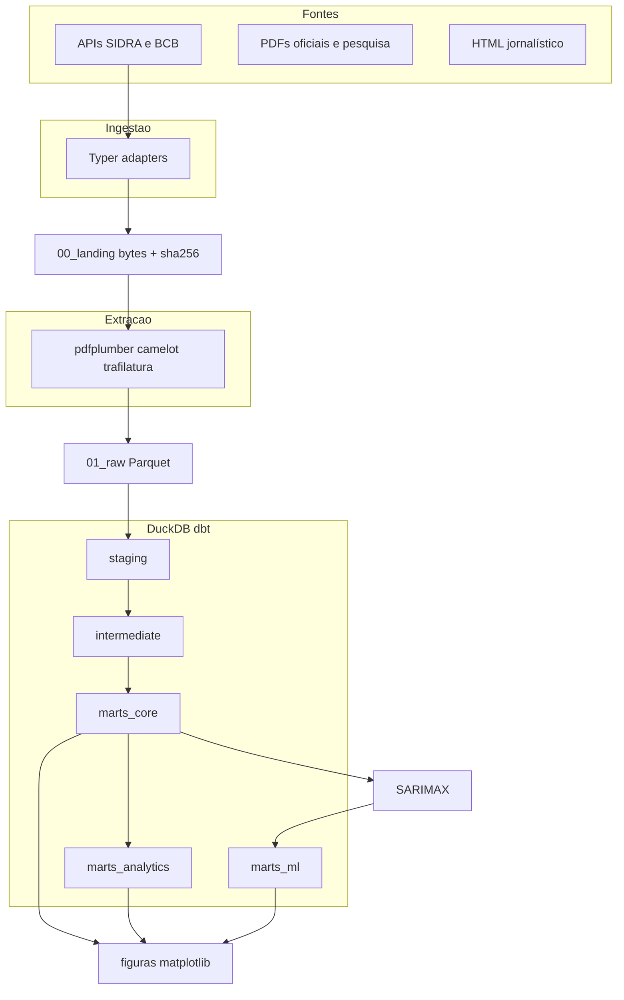

# Arquitetura

Janela 2023–2026. Eixo: substituição de orçamento. Camadas Medallion com fronteira rígida entre I/O e SQL de negócio.

## Por que cada ferramenta está onde está

| Camada | Ferramenta | Motivo |
| --- | --- | --- |
| Fundação | `uv` + Python 3.12 | Lockfile. 3.14 da máquina não tem wheel estável para dbt/camelot. |
| Ingestão | Typer, httpx, tenacity | I/O sujo. dbt não faz chamada de rede: se a SIDRA cair, `dbt build` ainda roda no raw. |
| Extração | pdfplumber / camelot / trafilatura / pandera | Parser evolui sem rebaixar. pandera testa forma; dbt testa semântica. |
| Lake | Parquet + DVC (Cloudflare R2) | Landing imutável. Drive exigiria service account no CI. |
| Warehouse | DuckDB | Um arquivo, zero servidor. `*.duckdb` no `.gitignore`. |
| Transformação | dbt-duckdb | Todo SQL de negócio. Lineage e testes colados no model. |
| Orquestração | Dagster na etapa 7 | Ver [ADR 0001](adr/0001-orquestracao-dagster-em-vez-de-airflow.md). |
| ML | statsmodels SARIMAX na etapa 8 | Coeficiente, IC e p-valor. Precisamos poder dizer "efeito indistinguível de zero". |
| Apresentação | matplotlib na etapa 9 | Consome o DuckDB; grava `exports/figures/*.png` + HTML. Poucos pontos; sem modelo semântico. Ver [ADR 0005](adr/0005-figuras-em-vez-de-power-bi.md). |

## Três schemas de marts

- `marts_core` — star schema estável. Entra nas figuras (produção anual, etc.).
- `marts_analytics` — agregados por pergunta (Ato 1, 2 e 3). Folha do DAG, reescrevível.
- `marts_ml` — saída do contrafactual, lida pelas figuras na banda de confiança.

## Narrativa que a arquitetura precisa sustentar

1. **Ato 1.** A cerveja não caiu no agregado, e a manchete de 2025 inverte conforme o vintage de 2024. Fecha com o contrafactual dentro do intervalo.
2. **Ato 2.** De onde saiu o dinheiro (Locomotiva / Fundaj / BCB / Klavi) e o que mudou por dentro do mix de cerveja.
3. **Ato 3.** Contraste estrutural (emprego, receita, custo social) e hipóteses rivais, com os limites ditos em voz alta.
